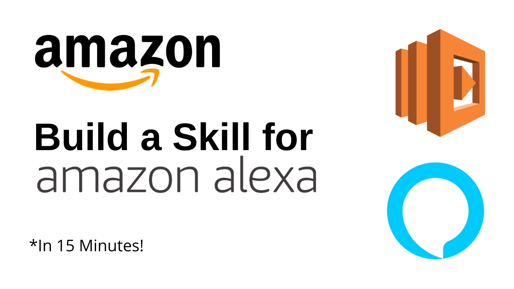

# Alexa-Fact-Skill
With the help of my YouTube Tutorial and this repository, I aim at helping you develop an Alexa Skill which when invoked will get you random tech facts!
Reference from [Alexa's Official Repository](https://github.com/alexa/skill-sample-nodejs-fact)   

## Tutorial Video

## Alexa Developer Console / Alexa Skill Kit (ASK)
- Head over to the Alexa Developer Console by clicking [here](https://developer.amazon.com/alexa/console/ask/).
- To create a new skill, click on Create Skill.
- Use this given combination to follow the tutorial:
  - Name: [Name Your App]
  - Default Language: English (IN)
  - Choose a Model to add your skill: Custom
  - Choose a method to host your skill's backend resources: Provision your own (We'll be using AWS Lambda)
  - Choose a Template: Fact Skill (To make things easier. We can build one from Scratch as well.)
- Select Invocation Name, for the same you need to use two words as the name to invoke your skill.
- Under Intents, enter what you want the user to say to invoke the skill.
- Save and Build the Model.

## AWS Lambda
- While inside the AWS Management Console. open AWS Lambda.
- Click on Create a Function.
- In the "Choose one of the following options to create your function." prompt, select Browse Serverless App Repository and search for 
  `alexa-skills-kit-nodejs-factskill`
- In the "Review, configure and deploy" prompt, scroll down to Application Settings and give a Name.
- Deploy!
- After it's deployed, click on "alexaskillskitnodejsfactskill", which is the main resource.
- Scroll down to find the environment and check for index.js.
- Copy code from [index.js](index.js) of this repository and paste it in the Lambda Environment.
- Make changes if any, say for example if you want to add food facts, change everything from tech to food. Don't forget to update the actual facts!
- Press Ctrl + S to save the file, then click on Save in the Environment to save the Lambda Function.
- Scroll up and remove the pre existing Alexa Skill Trigger. If you click on it you'll get the following message:
"Skill ID verification is not set for this trigger. As a best practice, we recommend that you delete this trigger and add a new one with Skill ID verification enabled."
- Click on Add Trigger and in the Select a Trigger dropdown, choose Alexa Skills Kit.
- In order to provide the Skill ID for the Alexa Trigger, go on to [Alexa Developer Console](https://developer.amazon.com/alexa/console/ask/) and under the Skill Name, you'll have an option to vie the Skill ID. Copy that and paste it onto AWS Lambda's Prompt. It will be similar to  
`amzn1.ask.skill.71057562-e56c-4b02-9609-ea87edd2b141`
- After you are done with it don't forget to save!
- At the top of the page, you'll observe an ARN, copy that as we'll use it soon. It will look something like this:
  `arn:aws:lambda:us-east-1:071240459979:function:serverlessrepo-sample-alexaskillskitnodejsfactskil-HHW5HQ86WZXD`

## Alexa Developer Console / Alexa Skill Kit (ASK) v2.0
- Head over to Endpoint. You'll have a message like this: "You must create your own AWS Lambda or HTTPS endpoint for your skill to pass certification and be published. You can refer to instructions for setting up an endpoint and use the pre-defined backend code for the templates here.".
- Enter the ARN in the input box marked with Default Region.
- Once you're done, click on Save Endpoints.
- Head over to Test and here you can Test your Alexa Skill.
- If you develop your desired skill and want to publish it, click on Distribution, fill all details, then head over to Certification.
- You need to submit your Skill for review and after it's approved, you can use it across all Alexa enabled devices and have others use it too!

## To Update The List/ Introduce a New Topic
Make amends to the [index.js](index.js) file. Add new statements and facts in place of the pre-existing ones. Add your topic in place of "tech" wherever it's mentioned.

## Collaborators
- Aaishika S Bhattacharya
